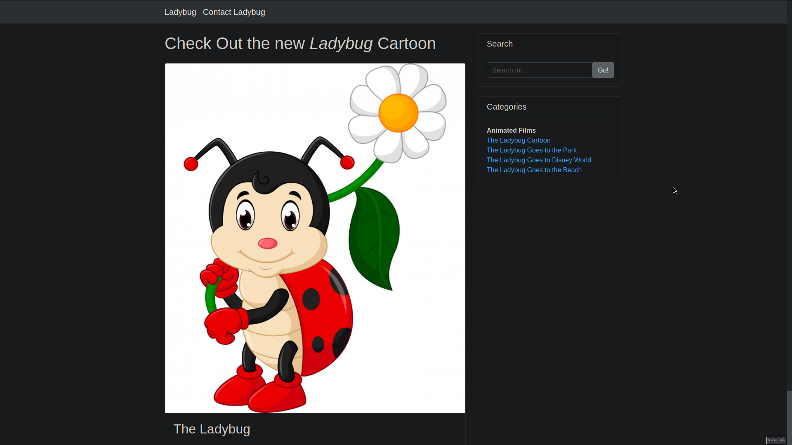
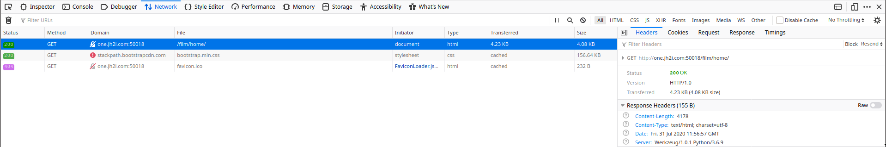
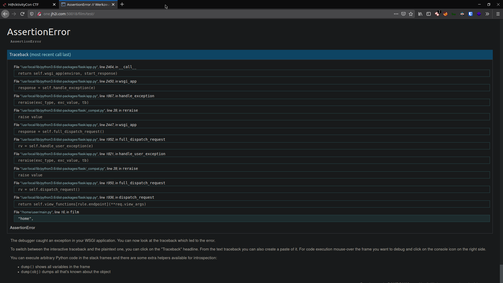
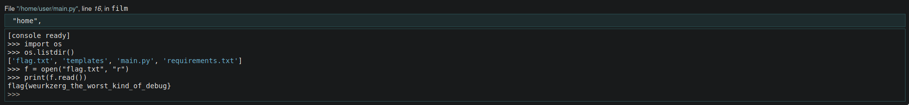

# Ladybug

Navigating to one of the 6 provided instances, we get:

1. A home page
1. A search field
1. Links to animations
1. Link to Contact Ladybug



As I went though the pages, the pages for the "Animated Films" are all the same as the home page, with only the image & its title & captions different.

Looking at the requests & responses in Firefox' developer tools shows that this uses a Python back-end.



```
HTTP/1.0 200 OK
Content-Type: text/html; charset=utf-8
Content-Length: 4283
Server: Werkzeug/1.0.1 Python/3.6.9
Date: Fri, 31 Jul 2020 12:05:03 GMT
```

Thanks to some hints on Discord, I found out that this was a Flask server (and that Flask is popular is a Python back-end for CTFs). Looking up "Flask vulnerabilites" shows a lot of information about Flask Server-side Template Injection (SSTI) so I went with that for now.

Trying to use the search field yields no result. It just doesn't show any kind of response to the query so I couldn't really determine what was working and what wasn't. It does put the query in the URI but doesn't reflect anything on the page. Trying SSTI with `http://one.jh2i.com:50018/?search={{1%27+2%27}}` and the likes doesn't work either.

As I was playing around, I found that invalid URIs raise big errors.

URI: `http://one.jh2i.com:50018/film/test/`



Apparently, this Flask server is running with debugging enabled. Luckily for us, this debugging page has a built-in Python shell!

The rest is just finding and reading the flag.


